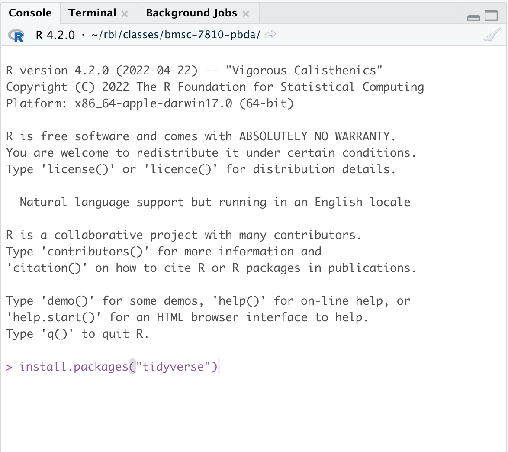
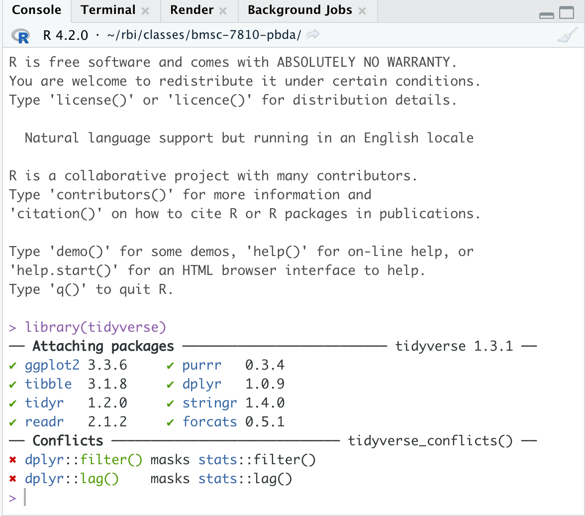
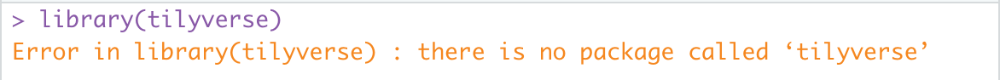

This article will explain how to install R, Rstudio, and R packages. 

**Please also watch the video at the end of the article that gives an overview of using Rstudio and the Rmarkdown format.**

## Download R

Download R from CRAN. Go to the CRAN homepage https://cran.r-project.org/. Select the link to download R for your operating system. 

### MacOS

Install the newest R version (`4.2.1`). We recommend installing the version for Intel Macs. If you have a Mac with an M1 processor  (click the Apple -> About this Mac, see information under `chip`), we still recommend using the Intel version of R as it is much easier to install packages built for the intel version at this time.  Download the `.pkg` file, open and follow the prompts to install. 


### Windows

Select the `base` link, then click `Download R-4.2.1 for Windows` to download the `.exe` file. Open this file to install R. 

### Linux

If you are on linux, then follow the documentation for your linux OS. 
  
## Download Rstudio

Go to the [Rstudio website](https://rstudio.com/products/rstudio/download/#download) and download Rstudio Desktop for your OS. 

Once downloaded and installed, open up `Rstudio` to complete the rest of the tutorial.  


## Download compiler tools  

### MacOS

To install the necessary compilers, we will follow the recommend steps outlined by CRAN: https://mac.r-project.org/tools/  

You will need to install the xcode command line tools if a package requires compilation. Open Rstudio and click on the "Terminal" pane. Alternatively you can open the Terminal app from `/Applications/Utilities/` (or use the search tool to search for terminal)
     
Type the following into terminal: 

```bash
sudo xcode-select --install
```

Type in your macOS password, press enter and then click “Install”. This download will require ~9Gb. Verify the installation by typing into terminal:

```bash
gcc --version
```

Which should print something similar to this:  

```bash
#' gcc (GCC) 4.8.5
#' Copyright (C) 2015 Free Software Foundation, Inc.
#' This is free software; see the source for copying conditions.  There is NO
#' warranty; not even for MERCHANTABILITY or FITNESS FOR A PARTICULAR PURPOSE.
```

Here's a [youtube video explainer](https://www.youtube.com/watch?v=Z01lzHNrSdU&feature=emb_title) 
    
Next you need to install `gfortran`, which can be obtained from the CRAN instruction site above. We recommend using the intel version of R, so please follow the instructions for Intel Macs and install gfortran using the `gfortran-8.2-Mojave.dmg` installer.

Once you've run the `gfortran` installer the last step is to make sure that this program is in your [`PATH`](https://en.wikipedia.org/wiki/PATH_(variable)). This step will make the gfortran program visible to R, and other programs.  

First determine which type of shell you have (typically bash or zsh). Execute the following in a terminal (click either on the terminal pane in Rstudio, or open the terminal app in macOS).

```bash
echo $SHELL
```

If you see `/bin/zsh` then make a plain text file called `.zshrc` in your home directory (e.g. `/Users/Your-macOS-username/`), if it doesn't already exist. If instead you see `/bin/bash` then make a file called `.bashrc` in your home directory, if it doesn't already exist. You can use Rstudio to make a new plain-text file (File->New file->Text) or by opening up the Textedit app, then click Format->Make Plain Text. 

Add the following line of text to the file (and keep any other text if already present).

```bash
export PATH=$PATH:/usr/local/gfortran/bin
```

Save the text file to your home directory. You may need to rename the file after saving to ensure that it doesn't end with `.txt.` (e.g. rename `.zshrc.txt` -> `.zshrc`). This file will be a hidden file. Hidden files can be seen in the Finder app by pressing `Command` + `Shift` + `.` (period) to toggle on/off visulizaing hidden files. 

Close and reopen Rstudio.

### Windows

You need to install `Rtools` from CRAN. Go to this link and download the exe installer for your OS: https://cran.r-project.org/bin/windows/Rtools/
     
### Linux
You should have a compiler available already.
  
## Installing the tidyverse and Rmarkdown packages

Once you have R and Rstudio set up, open up Rstudio, then we will install packages. Packages are extensions to the base R installation that provide additionally functionality to the language. In this course we will use packages from the [tidyverse](https://www.tidyverse.org/), which is a collection of packages commonly used for data science and interactive data analysis. Installing the `tidyverse` package will install the [entire collection](https://www.tidyverse.org/packages/) of tidyverse packages. 

[CRAN](https://cran.r-project.org/) is the official R package repository. CRAN has 18,000+ packages, including the tidyverse packages. Packages from CRAN are installed using the `install.packages()` function. A successful install will only need to be done once for the course.

Open Rstudio to launch R. Then in the console pane, execute the following command to install the [tidyverse](https://www.tidyverse.org/):

```r
install.packages("tidyverse")
```

```{r, echo = FALSE}

```


This command will take a few minutes to run while all of the packages are installed. Package installation will be completed once the `>` prompt reappears. Once complete, test package installation by loading the package(s)

```r
library(tidyverse)
```

If successful you will see something like this:

```{r, echo = FALSE}

```
An error will look like this (note misspelled package name for demonstration purposes):

```{r, echo = FALSE}

```

If loading tidyverse completes without errors then the packages have been installed. You'll also now see additional packages (`ggplot2`, `dplyr`, `tidyr`) listed under the "Packages" pane. 

If there is an error installing tidyverse, you'll likely see the following at the end of the command:

```r
#' Warning in install.packages :
#'  installation of package ‘tidyverse’ had non-zero exit status
```

If this happens, contact the course instructors to help troubleshoot the installation issue. 

Another package that we will use in the course is rmarkdown, to install run:

```r
install.packages("rmarkdown")
```

and verify installation by running `library(rmarkdown)`

## Install packages from other sources

**At this you will only need to install the tidyverse and rmarkdown packages **

There are 2 additional commonly used repositories for R packages that you should know about:

1) [Bioconductor](https://bioconductor.org/) is a repository that hosts 2,000+ bioinformatics related packages. 

To install bioconductor packages you should use the CRAN package `BiocManager`. BiocManager has a function called `install()` to install bioconductor packages. For example to install [`ComplexHeatmap`](https://jokergoo.github.io/ComplexHeatmap-reference/book/index.html)

```r
install.packages("BiocManager")
```

```r
library(BiocManager)
install("ComplexHeatmap")
# or equivalently you could run BiocManager::install("ComplexHeatmap")
```

2) [Github](https://github.com/) hosts open-source code from millions of software projects. R packages hosted on github can be installed using the `remotes` package. Packages on github are generally the development version of a package, or a package that has not been contributed to either CRAN or Bioconductor. To install you'll need to find the organization name and the repository name on github to install. 

For example to install the [LaCroixColorR package](https://github.com/johannesbjork/LaCroixColoR):

```r
install.packages("remotes")
remotes::install_github('johannesbjork/LaCroixColoR')
```

## Introduction to using Rstudio and Rmarkdown

Now that you have installed R and Rstudio, please watch this video (~20 minutes) that provides an overview of how to use Rstudio [IDE](https://en.wikipedia.org/wiki/Integrated_development_environment) and an introduction to the [Rmarkdown format](https://rmarkdown.rstudio.com/lesson-1.html).

[intro-to-rstudio.mp4](https://www.dropbox.com/s/zuh153mlp7w2fio/intro-to-rstudio.mp4?dl=0)

[intro-to-rstudio.mov](https://www.dropbox.com/s/alrmoszei1ou6vr/intro-to-rstudio.mov?dl=0)
