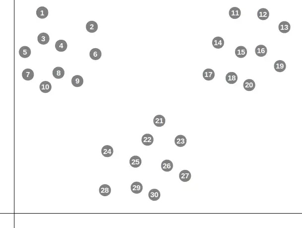
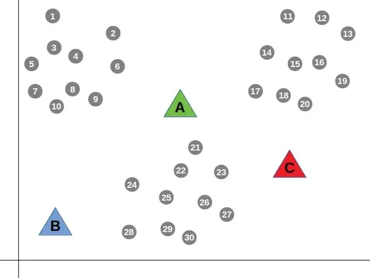
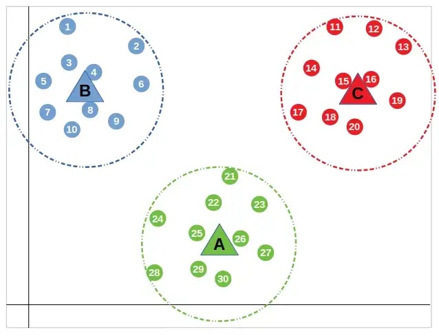
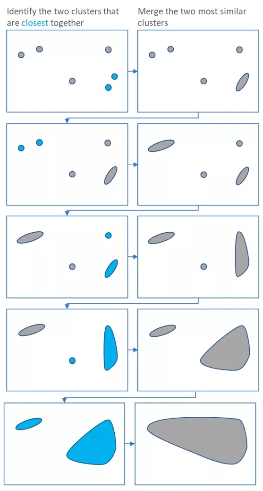
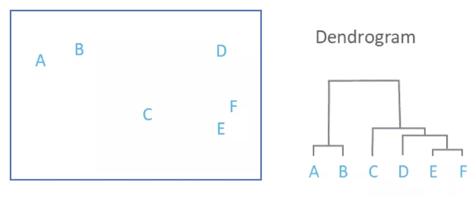

```{r setup, include=FALSE}
knitr::opts_chunk$set(echo = TRUE, message = FALSE, warning = FALSE)
```

*The Rmarkdown for this class is [on github]()*

## Goals for this class
* Learn about different types of clustering
* Cluster data using these different approaches
* Learn how to use dimensionality reduction to visualize complex data

## Load packages
```{r load-packages}
library(tidyverse)
library(factoextra)
library(here)
```

## Download files

Before we get started, let's download all of the files you will need for the next three classes. This script can be found [here](). You should put this script in the same folder as your rmarkdown

```{r, eval = FALSE}
# conditionally download all of the files used in rmarkdown from github 
source("download_files.R")
```

## What is clustering

Clustering is grouping together similar objects or elements. Clustering is a very important part of any type of data analysis.

1. Clustering is important for grouping important data togeher - it is what powers those "for you" posts you get when clicking on news articles
2. Cluster is also important for biology, it helps us group samples together in RNA-seq or in any experiment where you can get many measurements for samples, cells together in single cell methods
3. It can also be used to group together states or districts that are likely to vote in similar ways

Clustering is an unsupervised task - this means that it tries to group together items with no previous knowledge

### K - means clustering

I'm loosely following the [tutorial here](https://towardsdatascience.com/how-does-k-means-clustering-in-machine-learning-work-fdaaaf5acfa0) through this section. Click on the above link for a more in-depth discussion.

k-means clustering uses the distance between points as a measure of similarity. The basic idea is that we are adding k points to the data, called centroids that will try to center themselves in the middle of k clusters. This means that the value of k - set by the user, is a very important value to set.

Consider the dataset below

```{r, echo = FALSE}

```

In the figure above you would probably say that there are 3 clear clusters. Let's start by giving a k of 3.

First the centroids are placed randomly and the mean distance between the centroid and the closest points is calculated.

```{r, echo = FALSE}

```

This is done until the distance between the centroid and the nearest points doesn't change. All points that are closest to the centroid are placed in that cluster

```{r, echo = FALSE}

```

Let's try clustering on our own example:

```{r}
theme_set(theme_classic(base_size = 10))

test_data <- data.frame("x_val" = c(1, 3, 10, 12, 11,
                                    13, 11, 3, 2, 15,
                                    9, 2, 13, 12, 11),
                        "y_val" = c(10, 12, 3, 2, 10,
                                    3, 1, 10, 13, 2,
                                    1, 13, 12, 13, 11))

rownames(test_data) <- letters[1:nrow(test_data)]

```

Let's quickly plot it to get a feeling of what it looks like

```{r}
ggplot(test_data, aes(x = x_val, y = y_val)) +
  ggplot2::geom_point(size = 2)
```

Here it looks like we have three clusters. Let's try running the k means clustering algorithm. We will be using `kmeans`. The `centers` corresponds to the number of clusters we expect in the data. The `nstart` corresponds to the number of random starting points to try (like the randomly placed centroids above).

```{r}
set.seed(123)
km.res <- kmeans(test_data, centers = 3, nstart = 25)
```

The return of this function is a list. To figure out the components returned we can use `names()`

```{r}
names(km.res)
```

The actually cluster information is in `km.res$cluster`, the position of the centroids is in `km.res$centers`

```{r}
km.res$cluster

km.res$centers
```

Let's add our clustering information to our data frame

```{r}
cluster_k3 <- cbind(test_data, "cluster" = km.res$cluster)
```

And replot with the new clusters

```{r}
cluster_k3$cluster <- factor(cluster_k3$cluster)
ggplot(cluster_k3, aes(x = x_val, y = y_val, color = cluster)) +
  ggplot2::geom_point(size = 2)
```

This looks like it did a pretty good job! What if we repeat with different values for k?

* K = 2

```{r}
set.seed(123)
km.res2 <- kmeans(test_data, centers = 2, nstart = 25)

cluster_k2 <- cbind(test_data, "cluster" = km.res2$cluster)

cluster_k2$cluster <- factor(cluster_k2$cluster)
ggplot(cluster_k2, aes(x = x_val, y = y_val, color = cluster)) +
  ggplot2::geom_point(size = 2)
```

Now two populations that appear visually different have been clumped together because we allowed for only 2 centroids.

**Exercise**
Repeat the process above, but compute for 4 clusters

```{r}
# TODO find k = 4 clusters

```


### Hierarchical clustering
Another option for clustering is using hierarchical clustering. This is another popular method and results in a dendrogram which you've likely seen before.

I'm loosely following the [tutorial here](https://www.displayr.com/what-is-hierarchical-clustering/) through this section. Click on the above link for a more in-depth discussion.

Basically, hierarchical clustering starts by treating each sample as a "cluster". It then does the following steps

1. Identify the two clusters that are closest together
2. Merge these two clusters to form a new cluster

Steps 1 and two are repeated until only one large cluster remains

```{r, echo = FALSE}

```

Each merging step is used to build a dendrogram

```{r, echo = FALSE}

```

To get an idea of how this is working, we can use the same toy data we generated above

```{r}
test_data <- data.frame("x_val" = c(1, 3, 10, 12, 11,
                                    13, 11, 3, 2, 15,
                                    9, 2, 13, 12, 11),
                        "y_val" = c(10, 12, 3, 2, 10,
                                    3, 1, 10, 13, 2,
                                    1, 13, 12, 13, 11))

rownames(test_data) <- letters[1:nrow(test_data)]

test_data %>%
  dplyr::mutate(sample = rownames(.)) %>%
  ggplot(aes(x = x_val, y = y_val, label = sample)) +
    geom_point(size = 2) +
    geom_text(hjust=2, vjust=0)
```

First, we should find the distances between the points. Below is the eucledian distances. Notice that the distance is computed for the rows. If we wanted to compute distances for the columns we would need to transform the matrix using `t()`

```{r}
dist(test_data[1:5,])
```


We can now run `hclust` which will perform hierarchical clustering using the output of `dist`

```{r}
hc <- hclust(dist(test_data))

plot(hc)
```

Based on the dendrogram above, we can see what points are the most similar (ie were clustered first). We can also see that it makes the most sense to break the data into 3 clusters. We can pull out these clusters using `cutree`

```{r}
hc_clusters3 <- cutree(tree = hc, k =3)

hc_clusters3

hc_clusters3 <- cbind(test_data, "cluster" = hc_clusters3)

hc_clusters3$cluster <- factor(hc_clusters3$cluster)

hc_clusters3 %>%
  dplyr::mutate(sample = rownames(.)) %>%
  ggplot(aes(x = x_val, y = y_val, label = sample, color = cluster)) +
    geom_point(size = 2) +
    geom_text(hjust=2, vjust=0)

```

And now you can see that the clusters agree exactly with the k - means clusters

**Exercise**
Repeat finding clusters using different points on the tree. For example, what if you make 2 clusters? What if you make 4 or 5?

```{r}
# TODO repeat finding clusters with different numbers of clusters

```

**Question**
Are the clusters always the same as the k-means clusters? Do they ever differ?

## Using dimensionality reduction to visualize data

In the example above, we only had two dimensions and could easily visualize them. What about our example dataset with 50 names and 20 states? How do we visualize that type of data? Even more daunting,what if we have 20,000 genes and 18 samples as part of a RNA-seq experiment, or even worse, 20,000 genes and 30,000 cells as part of a single cell RNA-seq experiment? To visualize this data, we have to use something called dimensionality reduction. PCA is a common dimensionality reduction to use and will work well for lots of data type (like bulk RNA-seq). Other dimensionality reduction tools will need to be used (like UMAP) to visualize single cell RNA-seq and CYTOF datasets (and other single cell approaches).

### Visualizing the data with PCA
There is an amazing tutorial on how PCA works [here](https://web.stanford.edu/class/bios221/book/Chap-Multivariate.html). We will talk a little today about how PCA works, but I highly recommend looking at this book for PCA and to learn many of the important statistical techniques used regularly in computational biology. One thing I like about the book is it includes a lot of R code that you can run yourself so you can really understand how these techniques work.

The overall goal of PCA is to find linear models that best fit the data. 

Let's walk through PCA (following the tutorial in Modern Statistics for Modern Biology) with only Alabama and Colorado to see how it works.

```{r}
names_mat <- read.csv(here("class_7-9_data", "boy_name_counts.csv"),
                      row.names = 1) %>%
  as.matrix()


normalized_mat <- t(t(names_mat) / colSums(names_mat))

# Selecting just Alabama and Colorado, making a data frame for plotting
normalized_dat <- normalized_mat %>%
  data.frame %>%
  dplyr::select(Alabama, Colorado)

```

The first way we can think about going from 2 dimensions to 1 dimension is to simply just use the values from one of the dimensions. For example, if we have Alabama and Colorado, we can simply describe the data using only the values for Alabama. This idea is shown as the red points below

```{r}
dim_plot <- ggplot(normalized_dat, aes(x = Alabama, y = Colorado)) +
  geom_point(size = 2)
dim_plot + geom_point(aes(y = 0), colour = "red") +
  geom_segment(aes(xend = Alabama, yend = 0), linetype = "dashed")

```

Unfortunately, this loses all of the information from Colorado. Instead, we can also try to find a line of best fit using linear regression. Linear regression is done using a model with response and explanatory variables. A line is fit to the data that attempts to minimize the distance from the response variables to the line. Because there is always a response and explanatory variable, we can perform linear regression to minimize the distance for Colorado or Alabama.

Let's first minimize the distance for Colorado. To perform linear regression, we will use the `lm` function. If we want to minimize the distance to Colorado, Colorado will be the response variable and our model will be `Colorado ~ Alabama`

```{r}
reg1 <- lm(Colorado ~ Alabama, data = normalized_dat)
names(reg1)
```

After running `lm` the return value is a list. The `coefficients` will give us the slow and the intercept (think $y = ax + b$). We can also use the `fitted.values` which are the predicted values for Colorado based on the model.

```{r}
a1 <- reg1$coefficients[1] # intercept
b1 <- reg1$coefficients[2] # slope
pline1 <- dim_plot + geom_abline(intercept = a1, slope = b1,
                                col = "blue")
pline1 + geom_segment(aes(xend = Alabama, yend = reg1$fitted.values),
                      colour = "red", arrow = arrow(length = unit(0.15, "cm")))

```

We can find the variance of the points on the blue line by using Pythagoras' theorem (because the values have x and y coordinates).

```{r}
var(normalized_dat$Alabama) + var(reg1$fitted.values)
```

We can now repeat linear regression and now minimize the disatnce for Alabama to the regression line (now Alabama is the response variable).

```{r}
reg2 <- lm(Alabama ~ Colorado, data = normalized_dat)
a2 <- reg2$coefficients[1] # intercept
b2 <- reg2$coefficients[2] # slope
pline2 <- dim_plot + geom_abline(intercept = -a2/b2, slope = 1/b2,
                              col = "darkgreen")
pline2 + geom_segment(aes(xend=reg2$fitted.values, yend=Colorado),
                      colour = "orange", arrow = arrow(length = unit(0.15, "cm")))

```

We can also find the variance of the points that are fit to this regression line

```{r}
var(normalized_dat$Colorado) + var(reg2$fitted.values)
```

So far we have attempted to minimize either the distance of Alabama or Colorado values from the regression line. Instead of minimizing just one distance, PCA tries to minimize the total distance from the line (in both the X and Y directions).

Let's run PCA and use matrix multiplication to visualize the first PC in our x-y space

```{r}
svda <- svd(as.matrix(normalized_dat))
pc <- as.matrix(normalized_dat) %*% svda$v[, 1] %*% t(svda$v[, 1]) # Matrix multiplication
bp <- svda$v[2, 1] / svda$v[1, 1]
ap <- mean(pc[, 2]) - bp * mean(pc[, 1])
dim_plot + geom_segment(xend = pc[, 1], yend = pc[, 2]) +
  geom_abline(intercept = ap, slope = bp, col = "purple", lwd = 1.5)
```

We can now find the variacne of the points in the PC space

```{r}
apply(pc, 2, var)
sum(apply(pc, 2, var))
```

Notice that this variance is the largest of the three lines we have fit.

From Modern Stats for Modern Biology

> If we are minimizing in both horizontal and vertical directions we are in fact minimizing the orthogonal projections onto the line from each point.
> 
> The total variability of the points is measured by the sum of squares ofthe projection of the points onto the center of gravity, which is the origin (0,0) if the data are centered. This is called the total variance or the inertia of the point cloud. This inertia can be decomposed into the sum of the squares of the projections onto the line plus the variances along that line. For a fixed variance, minimizing the projection distances also maximizes the variance along that line. Often we define the first principal component as the line with maximum variance.


Although it's good to know the inner workings of PCA, we can simply run this PCA analysis using `prcomp`.

Now that we have learned about some of the clustering techniques, we are going to continue working with the same data we used to talk about matrices, the top 100 boy and girl names by state for 2020. We will want to use the normalized data for these examples.


```{r}
names.pca <- prcomp(normalized_mat)
```

The values for the dimensionality reduction are found in the `x` slot.

```{r}
pca_vals <- names.pca$x %>%
  data.frame()

pca_vals[1:5, 15]
```

We can also find the percent of variance explained by each component using the `sdev` slot

```{r}
names.pca$sdev[1:5]

percentVar <- names.pca$sdev^2 / sum( names.pca$sdev^2 )
```


Now we can combine the two to make a PCA plot

```{r}
ggplot(pca_vals, aes(x = PC1, y = PC2)) +
  geom_point(size = 2) +
  xlab(paste0("PC1: ",round(percentVar[1] * 100),"% variance")) +
  ylab(paste0("PC2: ",round(percentVar[2] * 100),"% variance"))
```

*10 minute break*

## Implementing clustering on our dataset
Now that we've learned how to visualize our data, we will be able to more easily see the clustering reults. Let's put together everything we've learned so far and try out the different clustering methods on our names data.

### K means clustering of names
The first thing we need to do is decide if we want to cluster the states or the names. Our first question is what names have the most similar usage? To answer this question, we will need to cluster the names.

From the PCA plot above, it doesn't look like there are strong clusters. Let's start with 2 clusters.

```{r}
set.seed(123)
km.res2 <- kmeans(normalized_mat, centers = 2, nstart = 25)
km.res2$cluster
```

We can again add this information to the plot

```{r}
pca_cluster <- cbind(pca_vals, "cluster" = km.res2$cluster)

pca_cluster$cluster <- factor(pca_cluster$cluster)
ggplot(pca_cluster, aes(x = PC1, y = PC2, color = cluster)) +
  geom_point(size = 2) +
  xlab(paste0("PC1: ",round(percentVar[1] * 100),"% variance")) +
  ylab(paste0("PC2: ",round(percentVar[2] * 100),"% variance"))
```

Let's try again with 3 clusters

```{r}
set.seed(123)
km.res3 <- kmeans(normalized_mat, centers = 3, nstart = 25)

pca_cluster <- cbind(pca_vals, "cluster" = km.res3$cluster)

pca_cluster$cluster <- factor(pca_cluster$cluster)
ggplot(pca_cluster, aes(x = PC1, y = PC2, color = cluster)) +
  geom_point(size = 2) +
  xlab(paste0("PC1: ",round(percentVar[1] * 100),"% variance")) +
  ylab(paste0("PC2: ",round(percentVar[2] * 100),"% variance"))
```

**Exercise**
Try with 4 clusters, what names cluster together?

```{r}
# TODO Repeat with 3 clusters and repeat what names cluster together

```


### Hierarchical clustering of names

Now let's repeat the clustering of names using hierarchical clustering

```{r}
hc <- hclust(dist(normalized_mat))

plot(hc)
```

Based on the above plot, it seems like 3 clusters might be a good starting point

```{r, preview = TRUE}
hc_clusters3 <- cutree(tree = hc, k =3)


hc_clusters3 <- cbind(pca_vals, "cluster" = hc_clusters3)

hc_clusters3$cluster <- factor(hc_clusters3$cluster)

pca_cluster$cluster <- factor(pca_cluster$cluster)
ggplot(pca_cluster, aes(x = PC1, y = PC2, color = cluster)) +
  geom_point(size = 2) +
  xlab(paste0("PC1: ",round(percentVar[1] * 100),"% variance")) +
  ylab(paste0("PC2: ",round(percentVar[2] * 100),"% variance"))
```

**Exercise**
What two values are their own cluster? *Hint either remake the plot with the points labeled or look at the dendrogram above.

### Repeating by clustering states
What if our question is what states have the most similar name usage? We will answer this by instead clustering on the states.

Again we will start by making a PCA plot. This time we will need to transform the matrix first before running PCA to run it on the sates instead

```{r}
states_pca <- prcomp(t(normalized_mat))
```

We can again pull out the values for the PCA from the `x` slot and the percent of the variance explained by each PC by using the `sdev` slot.

```{r}
pca_vals <- states_pca$x %>%
  data.frame()

percentVar <- states_pca$sdev^2 / sum( states_pca$sdev^2 )
```


Now we can combine the two to make a PCA plot

```{r}
ggplot(pca_vals, aes(x = PC1, y = PC2)) +
  geom_point(size = 2) +
  xlab(paste0("PC1: ",round(percentVar[1] * 100),"% variance")) +
  ylab(paste0("PC2: ",round(percentVar[2] * 100),"% variance"))
```

We can now start by looking at 3 clusters using the kmeans clustering algorithm. Again, we will need to first transform the data to cluster the states rather than the names

```{r}
set.seed(123)
km.res3 <- kmeans(t(normalized_mat), centers = 3, nstart = 25)
km.res3$cluster
```

Notice now we are clustering by the state instead of the names.

```{r}
pca_cluster <- cbind(pca_vals, "cluster" = km.res3$cluster)

pca_cluster$cluster <- factor(pca_cluster$cluster)
ggplot(pca_cluster, aes(x = PC1, y = PC2, color = cluster)) +
  geom_point(size = 2) +
  xlab(paste0("PC1: ",round(percentVar[1] * 100),"% variance")) +
  ylab(paste0("PC2: ",round(percentVar[2] * 100),"% variance"))
```

This seems to pretty nicely segregate our data.

### Hierarchical clustering of states

Now let's repeat the clustering of names using hierarchical clustering, again we will need to transform the data first.

```{r}
hc <- hclust(dist(t(normalized_mat)))

plot(hc)
```

In the plot above we see 3 clear clusters

```{r}
hc_clusters3 <- cutree(tree = hc, k =3)


hc_clusters3 <- cbind(pca_vals, "cluster" = hc_clusters3)

hc_clusters3$cluster <- factor(hc_clusters3$cluster)

pca_cluster$cluster <- factor(pca_cluster$cluster)
ggplot(pca_cluster, aes(x = PC1, y = PC2, color = cluster)) +
  geom_point(size = 2) +
  xlab(paste0("PC1: ",round(percentVar[1] * 100),"% variance")) +
  ylab(paste0("PC2: ",round(percentVar[2] * 100),"% variance"))
```

**Exercise**

Try out several different cluster numbers for both the kmeans clustering and the hierarchical clustering. Do you ever find cases where they differ?

```{r}
# TODO test out several hierarchical and k means clustering cluster numbers

```

## I'm a biologist, why should I care?

* Clustering and visualizations are important for any question you are answering
  * Clustering and dimensionality reduction are key aspects of single cell RNA-seq analysis
  * CYTOF also relies on clustering and dimensionality reduction techniques
  * Even a project where you've taken several measurements (that you expect to be related) can be used to cluster your samples
  * Phylogenetic trees are just a form of hierarchical clustering
* You will likely encounter clustering in papers that you read. My goal is to improve your understanding of the techniques so you can better interpret them on your own

## Acknowldgements and additional references 

The content of this class borrows heavily from previous tutorials:

* K- means clustering
  * [Background](https://towardsdatascience.com/how-does-k-means-clustering-in-machine-learning-work-fdaaaf5acfa0)
  * [R example](https://www.datanovia.com/en/lessons/k-means-clustering-in-r-algorith-and-practical-examples/)
* Hierarchical clustering
  * [Background](https://www.displayr.com/what-is-hierarchical-clustering/)
  * [R example](https://www.r-bloggers.com/2016/01/hierarchical-clustering-in-r-2/)
* PCA
  * [Tutorial](https://web.stanford.edu/class/bios221/book/Chap-Multivariate.html)
