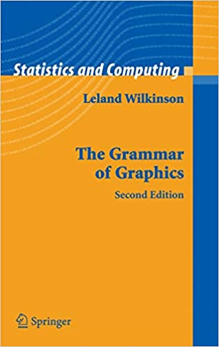

```{r setup, include=FALSE}
knitr::opts_chunk$set(echo = TRUE, message = FALSE, warning = FALSE)
library(ggplot2)
```

## Goals for today

- Introduction to plotting with the ggplot2 package
- The grammar of graphics concept
- Basic plotting 
- Adding additional information
- Other geometries
- Multiple geometries 
- Saving plots

## Additional Helpful Resources
ggplot2 package homepage :: https://ggplot2.tidyverse.org/  
R for Data Science :: https://r4ds.had.co.nz/  
ggplot2 Book :: https://ggplot2-book.org/  
Gallery of Plots and Examples :: https://r-graph-gallery.com/  

Data Visualization with ggplot2 :: Cheat sheet :: https://github.com/rstudio/cheatsheets/blob/main/data-visualization.pdf  

## The ggplot2 Package
```{r, echo = FALSE}
knitr::include_graphics("img/ggplot2.png")
```

This package allows you to declaratively create graphics by giving a set of variables to map to aesthetics and then layer graphical directives to produce a plot.
It's part of the tidyverse of R packages for data science and analysis, sharing in their design philosophy.
Alternative to the built in R graphics and plotting functions.  
**Written by Hadley Wickham**

## Grammar of Graphics
```{r, echo = FALSE}

```
- Grammar gives languages rules.
- Grammar has a technical meaning.
- Grammar makes language expressive.  

**-Leland Wilkinson 1945-2021**  

**Layers of logical command flow and readability.**


## Layers of ggplot2

```{r, echo = FALSE}
knitr::include_graphics("img/gglayers-qcbscaworkshop.png")
# source: https://r.qcbs.ca/workshop03/book-en/grammar-of-graphics-gg-basics.html
```

## Basic Grammar
**Plot = data + aesthetics + geometry**

**data** = the dataset, typically a dataframe  
**aesthetics** = map variables x and y to axis   
**geometry** = type of graphic or plot to be rendered  

**facets** = multiple plots  
**statistics** = add calculations  
**theme** = make the plot pretty or follow a particular style

```{r}
# ggplot(<DATA>, aes(<MAPPINGS>)) + <GEOM_function>()

?ggplot # bring up the ggplot function help
```


## Data to Plot
To begin plotting we need to start with some data to visualize.  Here we can use a built-in dataset regarding Motor Trend Car Road Tests called `mtcars`. This dataset is a dataframe which is a key format for using with ggplot. We can preview the data structure using the `head()` function.  

```{r}
#some built in data.

head(mtcars)
```
The data was extracted from the 1974 Motor Trend US magazine, and comprises fuel consumption and 10 aspects of automobile design and performance for 32 automobiles (1973–74 models).  

A data frame with 32 observations on 11 (numeric) variables.  

[, 1]	mpg	Miles/(US) gallon  
[, 2]	cyl	Number of cylinders  
[, 3]	disp	Displacement (cu.in.)  
[, 4]	hp	Gross horsepower  
[, 5]	drat	Rear axle ratio  
[, 6]	wt	Weight (1000 lbs)  
[, 7]	qsec	1/4 mile time  
[, 8]	vs	Engine (0 = V-shaped, 1 = straight)  
[, 9]	am	Transmission (0 = automatic, 1 = manual)  
[,10]	gear	Number of forward gears  
[,11]	carb	Number of carburetors  
**-R Documentation**

## Basic Plot

Using the basic ggplot grammar of graphics template we can produce a scatterplot from the dataframe.

```{r}
# ggplot(<DATA>, aes(<MAPPINGS>)) + <GEOM_function>()

ggplot(mtcars, aes(x=wt, y=mpg)) + geom_point()
```
We can change the data being plotted by picking a different column from the dataframe. For instance here we are plotting the horsepower(hp) versus miles per gallon(mpg). Also note that we can make the code more readable by placing proceeding layers on a different line after the plus sign.

```{r}
ggplot(mtcars, aes(x=hp, y=mpg)) + 
  geom_point()
```
## Adding Additional Information to the Plot

### Title

We can add a title to the plot simply by adding another layer and the **ggtitle()** function.  

```{r}
ggplot(mtcars, aes(x=hp, y=mpg)) + 
  geom_point() +
  ggtitle("Modern Cars: Horsepower vs Miles Per Gallon")
```
### X and Y axis Labels 

We can over write the default and add our own labels to the x and y axis by using the **xlab()** and **ylab()** functions respectively.  

```{r}
ggplot(mtcars, aes(x=hp, y=mpg)) + 
  geom_point() +
  ggtitle("Modern Cars: Horsepower vs Miles Per Gallon") +
  ylab("miles per gallon") + 
  xlab("horsepower")
```
### Getting Geometry Specific Help

We can easily add a third bit of information to the plot by using the color aesthetic. Each geometry has its own list of aesthetics that you can add and modify. Consult the help page for each one.  

```{r}
?geom_point() # bring up the help page for geom_point()
```

### Adding the Color Aesthetic

```{r}
ggplot(mtcars, aes(x=hp, y=mpg, color=cyl)) + 
  geom_point() +
  ggtitle("Modern Cars: Horsepower vs Miles Per Gallon") +
  ylab("miles per gallon") + 
  xlab("horsepower")
```
And we can relabel the legend title for the new color aesthetic to make it more readable.  

```{r}
ggplot(mtcars, aes(x=hp, y=mpg, color=cyl)) + 
  geom_point() +
  ggtitle("Modern Cars: Horsepower vs Miles Per Gallon") +
  ylab("miles per gallon") + 
  xlab("horsepower") +
  labs(color="#cylinders")
```
### A Fourth Aesthetic
You can even continue to add even more information to the plot through additional aesthetics. Though this might be a bit much.  

```{r}
ggplot(mtcars, aes(x=hp, y=mpg, color=cyl, size = wt)) + 
  geom_point() +
  ggtitle("Modern Cars: Horsepower vs Miles Per Gallon") +
  ylab("miles per gallon") + 
  xlab("horsepower") +
  labs(color="#cylinders", size="weight")
```

Instead we can use a specific value instead of the **wt** variable to adjust the size of the dots.  

```{r}
ggplot(mtcars, aes(x=hp, y=mpg, color=cyl, size = 3)) + 
  geom_point() +
  ggtitle("Modern Cars: Horsepower vs Miles Per Gallon") +
  ylab("miles per gallon") + 
  xlab("horsepower") +
  labs(color="#cylinders", size="weight")
```
## Other Geometries
There are many other geometries that you can use in your plots. Here is a short list:  

geom_point(): scatterplot  
geom_line(): lines connecting points by increasing value of x  
geom_path(): lines connecting points in sequence of appearance  
geom_boxplot(): box and whiskers plot for categorical variables  
geom_bar(): bar charts for categorical x axis  
geom_histogram(): histogram for continuous x axis  
geom_violin(): distribution kernel of data dispersion  
geom_smooth(): function line based on data  

### geom_line()
But utilizing the right plot to efficiently show your data is key. Here we swapped the geom_point for geom_line to see what would happen.  


```{r}
ggplot(mtcars, aes(x=hp, y=mpg, color=cyl)) + 
  geom_line() +
  ggtitle("Modern Cars: Horsepower vs Miles Per Gallon") +
  ylab("miles per gallon") + 
  xlab("horsepower") +
  labs(color="#cylinders")
```
### Ploting the Categories with geom_col()

```{r}
head(mtcars)
```

Looking back at the data structure of mtcars, we see that the names of the cars are stored as the row names of the data frame. We can access this using the `rownames()`function and use it in subsequent plots.

```{r}
rownames(mtcars)
```


```{r}
ggplot(mtcars, aes(x=rownames(mtcars), y=mpg)) + 
  geom_col() +
  ggtitle("Modern Cars: Horsepower vs Miles Per Gallon")
```
You will learn other ways to make this more legable later. For a quick fix we can swap the x and y mappings.

```{r}
ggplot(mtcars, aes(y=rownames(mtcars), x=mpg)) + 
  geom_col() +
  ggtitle("Modern Cars: Horsepower vs Miles Per Gallon")

```
We can reorder the data to make it easier to visualize important information.

```{r}
ggplot(mtcars, aes(y=reorder(rownames(mtcars), mpg), x=mpg)) + 
  geom_col() +
  ggtitle("Modern Cars: Horsepower vs Miles Per Gallon")

```

Take some time to play around with this template. Try substituting different columns from the dataframe. What works or doesn't work and why?  


## Multiple Geometries  

You can also add another layer of geometry to the same ggplot. Notice that since we need two separate aesthetic declarations that they have moved from the ggplot function to their respective geom_ functions. 

```{r}
ggplot(mtcars) +
  geom_point(aes(x=hp, y=mpg)) +
  geom_line(aes(x=hp, y=mpg, color=cyl)) +
  ggtitle("Modern Cars: Horsepower vs Miles Per Gallon") +
  ylab("miles per gallon") + 
  xlab("horsepower") +
  labs(color="#cylinders")
```
This particular geometry addition isn't very useful. Try adding geom_smooth() instead of geom_line().

## Saving Plots
Saving these plots is easy! Simply call the `ggsave()` function to save the last plot that you created.

```{r}
ggsave("plot.png") # saves the last plot to a PNG file in the current working directory
```

You can also specify the dots per inch and the width of height of the image to ensure publication quality figures upon saving.

```{r}
ggsave("plot-highres.png", dpi = 300, width = 8, height = 4) # you can specify the dots per inch (dpi) and the width and height parameters
```

## More Examples

Lets take a look at gallery resource to preview different plot types and get ideas for our own plots.  
https://r-graph-gallery.com/  

## SessionInfo
```{r}
sessionInfo()
```

