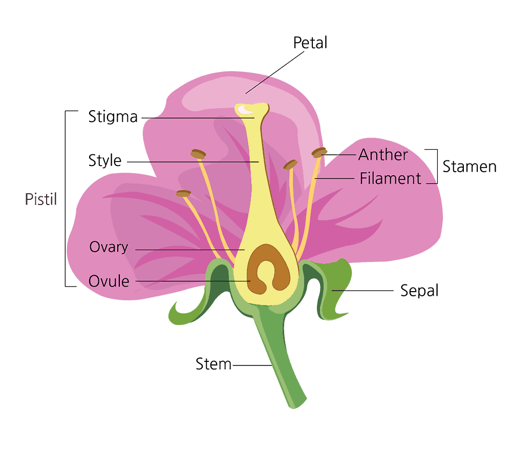
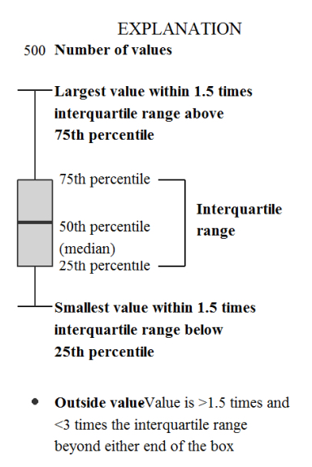

**The Rmarkdown for this document is:**

```{r setup, include=FALSE}
knitr::opts_chunk$set(echo = TRUE, message = FALSE, warning = FALSE)
library(tidyverse)
```

## Goals for today

-   New dataset: Iris
-   Plotting the categorical data from iris measurements
-   Box plots and violin plots
-   Frequency and density plots
-   Using stat layers
-   Adding additional annotations
-   Axis, scales, and coordinate Systems

## The Iris Dataset

For this class we are going to use a new built in dataset that involves
the measurements of Iris flowers. In particular the measurements involve
the width and length of two structures of the flower: the petal and the
sepal. Here is an overview of flower structure.

```{r, echo = FALSE}

# source: https://www.trees.com/gardening-and-landscaping/flowers
```

The Iris dataset is classically used in machine learning and
classification projects. Three species of iris were included in this
study: iris setosa, iris versicolor, and iris virginica. Measurements
were taken in 1936 by famous statistician RA Fisher known for the
Student's t-test and F-distribution.
<http://archive.ics.uci.edu/ml/datasets/Iris>

```{r, echo = FALSE}
knitr::include_graphics("img/iristypes.png")
```

Let's look at the this new dataset with `head`. You can see that it is
in *tidy* format with each observation being a new row.

```{r}
head(iris)
```

To get a list of the species in this study we can look at all the
`unique()` entries in the Species column.

```{r}
unique(iris$Species)
```

Each one of the species is represented and now we have the exact names
as written by each measurement. To get the number of measurements for
each species we can use the `summary()` function.

```{r}
summary(iris$Species)
```

We can begin by looking at the relationships between some of the
measurements by looking at a scatter plot. Here we have Sepal.Length on
the x-axis and Sepal.Width on the y-axis.

```{r}
ggplot(iris, aes(x = Sepal.Length, y = Sepal.Width)) +
  geom_point()
```

Exercise: Despite this showing all the data points. How is this not very
informative? As a review of last class, add to this plot to make it more
informative?

```{r}

```

Exercise: Remake this scatterplot but this time for `Petal.Width` and
`Petal.Length` and plot ONLY the `iris virginica` species data points.

```{r}

```

---

## Plotting the Categorical Data

### Species data points with geom_point

Typically we can look at the distribution of a particular measurement
value based on the category of the measurement, in this case the
species. In this way we can make comparisons between the species. As
before we can use a `geom_point_()` to plot the values for each species.

```{r}
ggplot(iris, aes(x = Species, y = Sepal.Width)) +
  geom_point()
```

While this does show a basic distribution of Sepal.Width for each
Species, many of the points that have the same value are actually
hidden! One way we can improve on this is by adding a bit of jitter or
random horizontal position to each point.

```{r}
ggplot(iris, aes(x = Species, y = Sepal.Width)) +
  geom_jitter()
```

Notice that if you rerun the plot the points are in different locations.
The space added by the jitter is randomly generated everytime. Don't
expect them to look the same everytime!

Side note: You can also use `geom_point()` geometry function with the
`position = position_jitter()` setting and it will generate the same
plot as with `geom_jitter()`

You can also tighten the range of the jitter by specifying a width.

```{r}
ggplot(iris, aes(x = Species, y = Sepal.Width)) +
  geom_jitter(width=0.1)
```

### The Boxplot

A frequently used plot that is used to better descriptively show this
type of data is a boxplot. We can generate a box plot of this data
simply by adding a second geom layer called `geom_boxplot()`. This way
we keep the point layer but also have the boxplot.

```{r, echo = FALSE}

#source: https://paulvanderlaken.com/2018/08/29/add-a-self-explantory-legend-to-your-ggplot2-boxplots/
```

Here we can add a `geom_boxplot` layer to our existing jittered
scatterplot.

```{r}
ggplot(iris, (aes(x = Species, y = Sepal.Width))) +
  geom_jitter() +
  geom_boxplot()
```

Exercise: Many of the points are hidden behind the boxplot. Try changing
the order of the layers to see if it matters. What is another way you
could fix this?

```{r}

```

### Violin Plot

Another type of frequently used plot is the violin plot. This plot shows
a continuous density distribution.

```{r}
ggplot(iris, aes(x = Species, y = Sepal.Width)) +
  geom_violin() +
  geom_jitter()
```

---

## Stats Layers

Stats or statistics layers allows us to calculate certain metrics about
our data and potentially visualize them. First we will look at some of the `geom` that use stats in their plots.

### Frequency and Density Plots

For instance here is a new type of plot that calculates frequency of counts across all measurements of
Sepal.Width. It uses a `stat` to count the number of measurements at specific values. We could also show the color `aes` to visualize all the species.

```{r}
ggplot(iris) +
  geom_freqpoly(aes(x = Sepal.Width))
```
`geom_dotplot()` is another way to visualize representative counts. Note that settings `stackgroups = TRUE` allows you to see all of the dots by stacking them vertically on top of one another without overlap. It uses a `stat` to count the number of measurements at specific values and represents them as a dot.

```{r}
ggplot(iris) +
  geom_dotplot(aes(x = Sepal.Width, fill = Species), stackgroups = TRUE)
```
Density plots can overlap to show a comparison between groups and visualize distribution. It uses a `stat` to calculate a density metric.

```{r}
ggplot(iris) +
  geom_density(aes(x = Sepal.Width, color = Species))
```
Finally we have a traditional histogram representing the counts of specific measurement values as above but plotted as a bar plot. It also uses a `stat` to count the number of measurements at these specific values.

```{r}
ggplot(iris) +
  geom_histogram(aes(x = Sepal.Width))
```

Underneath the hood the `geom_histogram` function is using a stat
function called `bin` this essentially taking each measurement and
placing it in a specific sized category and calculating the frequency of
this occurrence. We can modify either the `binwidth` or the number of
`bins` arguments to modify this behavior. For instance if there are 50
measurements from say 1 to 4.5. This range would be divided by the
number of bins. Each measurement value would fall into one of these bins
and a count would be added for that bin.

```{r}
ggplot(iris) +
  geom_histogram(aes(x = Sepal.Width), stat = "bin", bins = 10)
```

### Stat Functions

Stats layers are additional information that we calculate and add to the
plot. Essentially every `geom_` function that we have been seen utilizes
calculations to produce the plots. Each of these `geom_` functions has
an equivalent `stat_` function. It is beyond the scope of this class to
get into the details of all of these `stat` functions. Here we will look
at a particular function called `stat_summary` that we can use to plot
some summary statistics.

```{r}
ggplot(iris, aes(x = Species, y = Sepal.Width)) +
  geom_jitter() +
  stat_summary(fun = "mean",
               geom = "point",
               color = "red")
```

Some of the other options for `stat_summary`:

`geoms`: point, errorbar, pointrange, linerange, crossbar

`funs`: mean, median, max, min

```{r}
ggplot(iris, aes(x = Species, y = Sepal.Width)) +
  geom_jitter() +
  stat_summary(fun = "mean",
               geom = "crossbar",
               width = 0.5,
               color = "red")
```

We can combine multiple `stat_summary` layers to add additional
information.

```{r}
ggplot(iris, aes(x = Species, y = Sepal.Width)) +
  geom_jitter() +
  stat_summary(fun = "mean",
               geom = "crossbar",
               width = 0.5,
               color = "red") +
  stat_summary(fun = "median",
               geom = "crossbar",
               width = 0.5,
               color = "blue")
```

### Plotting the standard error and the confidence intervals

Plotting the standard error.

```{r}
ggplot(iris, aes(x = Species, y = Sepal.Width)) +
  geom_jitter() +
  stat_summary(geom = "errorbar",
               fun.data = mean_se)
```

To calculate the standard deviation and produce the confidence intervals
you can pass `mean_cl_normal` to the `fun.data` argument. Note you may
need to install the `Hmisc` package to get this working.
`install.packages("Hmisc")`

```{r}
ggplot(iris, aes(x = Species, y = Sepal.Width)) +
  geom_jitter() +
  stat_summary(geom = "errorbar",
               fun.data = mean_cl_normal)
```

---

## Annotations

Annotations are easy ways to add extra emphasis to your plots. It can be
much more efficient to have them placed on your plots programatically
rather than trying to add them later with Photoshop or Illustrator.

### Using geom_text()

`geom_text()` is an easy way to play text on a plot to annotate. We can even use its `aes()` function to add column information to the plot like so.

```{r}
ggplot(iris, aes(x = Sepal.Length, y = Sepal.Width)) +
  geom_point() +
  geom_text(aes(label=Species))
```
Not very practical. Let's look at the documentation to get some better ideas.

```{r}
?geom_text
```

There are several options we can add to make things a little neater.

```{r}
ggplot(iris, aes(x = Sepal.Length, y = Sepal.Width)) +
  geom_point() +
  geom_text(aes(label=Species), nudge_y = .1, check_overlap = T, size = 3)
```
We can also manually place text anywhere we would like in the plot. This could be a way to annotate whole groups or parts of the visualization.

```{r}
ggplot(iris, aes(x = Sepal.Length, y = Sepal.Width)) +
  geom_point(aes(color= Species)) +
  geom_text(aes(label="setosa"), x=5, y=4, size = 5) +
  geom_text(aes(label="versicolor"), x=5.5, y=2.25, size = 5) + 
  geom_text(aes(label="virginica"), x=7.5, y=3.5, size = 5)
```

### The annotate function

The annotate function can be used to pass specific types of geometries
that you can manually draw on your plot.

```{r}
?annotate
```

Here is an example of drawing a rectangle.

```{r}
ggplot(iris, aes(x = Sepal.Length, y = Sepal.Width)) +
  geom_point(aes(color= Species)) +
  annotate("rect", xmin=5.5, xmax=6.5, ymin=2.5 , ymax=3.2, alpha=0.2, color="blue")
```

Using a segment geom to produce an arrow. Notice how we need to add the
arrow function.

```{r}
ggplot(iris, aes(x = Sepal.Length, y = Sepal.Width)) +
  geom_point(aes(color= Species)) +
  annotate("segment", x = 7, xend = 7, y = 4.5, yend = 3.25, color = "pink", size=3, alpha=0.6, arrow=arrow())
```

### Drawing intercept lines with geom_lines

You can add horizontal or vertical lines to show cut offs.

```{r}
ggplot(iris, aes(x = Sepal.Length, y = Sepal.Width)) +
  geom_point(aes(color= Species)) +
  geom_hline(yintercept=4, color = "orange", size = 1)
```

```{r}
ggplot(iris, aes(x = Sepal.Length, y = Sepal.Width)) +
  geom_point(aes(color= Species)) +
  geom_vline(xintercept=7, color = "orange", size = 1)

```
Can add a slope line.

```{r}
ggplot(iris, aes(x = Sepal.Length, y = Sepal.Width)) +
  geom_point(aes(color= Species)) +
  geom_abline(slope = .5, intercept = 1)

```

### Filtering data as annotation

You can also filter your data during the annotation process and use that
as a way to clearly highlight features of interest.

Here by limiting the color to specific measurements.

```{r}
ggplot(iris, aes(x = Sepal.Length, y = Sepal.Width)) +
  geom_point() + 
  geom_point(data = filter(iris, Sepal.Width > 3.25), aes(color = Species))
```

And here by limiting the text annotation to specific measurements.

```{r}
ggplot(iris, aes(x = Sepal.Length, y = Sepal.Width)) +
  geom_point(aes(color = Species)) + 
  geom_text(data = filter(iris, Sepal.Width > 4), aes(label = Species), vjust = 1)
```

Exercise: Plot a scatter plot of the `Petal.Length` and `Petal.Width` and color by the species of iris. Place a rectangle around the group of points representing the data from the setosa species. Place text above the rectangle that displays "smallest flower".

```{r}

```


---

## Axis, Scales, and Coordinate Systems

Scales are ways of modifying how the data and the coordinates are shown. When you run this code below there are actually several default hidden scales functions being added.

```{r}
ggplot(iris, aes(x = Petal.Length, y = Petal.Width)) +
  geom_point()
```
Notice how there are three scale function layers added. These are actually being run above but are hidden by default. If you run this version you will get the same plot as above.

```{r}
ggplot(iris, aes(x = Petal.Length, y = Petal.Width)) +
  geom_point() +
  scale_x_continuous() + 
  scale_y_continuous() + 
  scale_colour_discrete()
```

Basically `scale_x_` and `scale_y_` functions can be used to modify the respective axis appearance and type. For instance we can change the x axis to be on a log scale by using `scale_x_log10()`. Great way to visualize without having to transform the actual data.

```{r}
ggplot(iris, aes(x = Petal.Length, y = Petal.Width)) +
  geom_point() +
  scale_x_log10()
```
You can also reverse an axis.

```{r}
ggplot(iris, aes(x = Petal.Length, y = Petal.Width)) +
  geom_point() +
  scale_x_reverse()
```

You can manually set the x and y axis range by using the `xlim()` and `ylim()` functions.

```{r}
ggplot(iris, aes(x = Petal.Length, y = Petal.Width)) +
  geom_point() +
  xlim(0,10) +
  ylim(0,5)
```

The third default scale in the plot was `scale_colour_discrete()`. This type of scale modifies how the color can be mapped across the data.

```{r}
ggplot(iris, aes(x = Species, y = Sepal.Width, color= Sepal.Length)) + 
  geom_jitter()  + 
  scale_color_gradient(low = "blue", high = "red")
```

```{r}
#use autocomplete to all the scales options
#scale_
```


Last class I showed that you could quickly change the axis to swap the
coordinates. Here is another way to do that by interacting with the
coordinate layer using the `coord_flip()` function.

```{r}
ggplot(iris, aes(x = Species, y = Sepal.Width)) +
  geom_violin() +
  geom_jitter() +
  coord_flip()
```

---

## SessionInfo

```{r}
sessionInfo()
```
