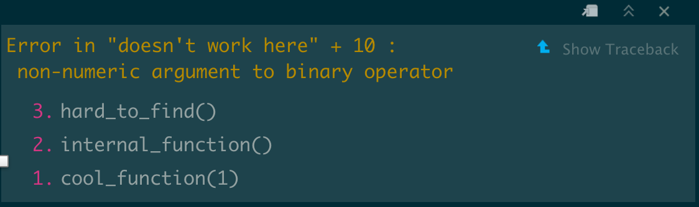

```{r setup, include = FALSE}
knitr::opts_chunk$set(
  collapse = TRUE,
  message = FALSE,
  warning = FALSE,
  comment = "#>",
  fig.align = "center"
)
library(tidyverse)
library(here)
```


## Rmarkdown 

Read the [Guide to RMarkdown](https://bookdown.org/yihui/rmarkdown/) for an exhaustive description of the various formats and options for using RMarkdown documents. Note that HTML for this class were all made from Rmd, using the [distill blog format](https://rstudio.github.io/distill/) 

### Caching

You can speed up knitting of your Rmds by using caching to store the results from each chunk, instead of rerunning them each time. Note that if you modify the code chunk, previous caching is ignored.
  
For each chunk, set `{r, cache = TRUE}`

Or the option can be set globally at top of the document. Like this:

```r
knitr::opts_chunk$set(cache = TRUE)
```

### Better, save and load .rds files

Run once, save, and load instead of rerunning resource intensive parts.

If you have non-deterministic functions, such as `kmeans`, remember to `set.seed`, or save and load result objects.

```{r, eval = FALSE}
if(!file.exists("long-step.rds")){
  ...
  code or a script
  source("path/to/script.R")
  ...
  saveRDS(obj, "long-step.rds")
} else {
  obj <- readRDS("long-step.rds")
}
```

## `here`, folder structure management

https://github.com/jennybc/here_here

```{r here, eval = FALSE}
here::here() # always points to top-level of current project

here::here("_posts", "2022-10-03-install-r", "install-r.Rmd") # never confused about folder structure
```

## `styler`, clean up code readability

Refer to this [style guide](http://adv-r.had.co.nz/Style.html) often, so you don't have to go back to make the code readable/publishable later.

```{r styler}
styler::style_text("
my_fun <- function(x, 
y, 
z) {
  x+ z
}
                   ")

# styler::style_file   # for an entire file
# styler::style_dir    # directory 
```


## Benchmarking, with `microbenchmark` and `profvis`

```{r bench, eval = TRUE}
# example, compare base and readr csv reading functions
path_to_file <- here("data/class3/dmel_peptides_lifecycle.csv.gz")

res <- microbenchmark::microbenchmark(
  base = read.csv(path_to_file),
  readr = readr::read_csv(path_to_file),
  times = 5
)
print(res, signif = 2)
```


```{r, eval = TRUE}
# example, looking at each step of a script
library(tidyverse)
p <- profvis::profvis({

  df <- readr::read_csv(path_to_file)
  df <- df %>%
    filter(e02_4 < 50) %>%
    mutate(sequence = str_to_lower(Sequence))
})
p
```


## Debugging R code

R has a debugger built in. You can debug a function:

e.g.:  

```{r, eval = FALSE}
debug(read_csv) # set a function to debug
read_csv(path_to_file) # will enter debug mode
undebug(read_csv)
```

Rstudio has great support for debugging functions in Rscripts or in packages:

https://support.posit.co/hc/en-us/articles/200713843-Debugging-R-code-with-the-RStudio-IDE

### Look at the call stack with traceback()

```{r, eval = FALSE}
cool_function <- function(x) {
  
  internal_function <- function(y) {
    
    hard_to_find <- function(z) {
      "doesn't work here" + 10
    }
    
    hard_to_find()
  }
  internal_function()
}

cool_function(1)
traceback()
```

```{r, echo = FALSE}

```
## Building your own R package

It's surprisingly easy, particularly with Rstudio, to write your own R package to store your code. Putting your code in a package makes it much easier to debug, document, add tests, and distribute your code.

- https://r-pkgs.org/
- https://hilaryparker.com/2014/04/29/writing-an-r-package-from-scratch/


## `shiny`, interactive web app for data exploration

Making an interactive interface to data and plotting is easy in R. Examples and corresponding code can be found at https://shiny.rstudio.com/gallery/.

## Parsing specific types of formats:

There are generally packages built to read and write from most formats. Some examples:

### JSON

Check out [jsonlite](https://cran.r-project.org/web/packages/jsonlite/vignettes/json-aaquickstart.html)

```{r}
library(jsonlite)
json_file <- "http://api.worldbank.org/country?per_page=10&region=OED&lendingtype=LNX&format=json"
worldbank_data <- fromJSON(json_file, flatten=TRUE)
worldbank_data

```

### Genomics data (fasta, fastq, vcf, bam, bed, bigwig)

Check out `rtracklayer` and `Rsamtools`:

e.g. read a FASTA file into R:

```{r fa}
library(Rsamtools)

# get path to test file included in a package
fasta_file <- system.file('extdata', 'ce2dict1.fa', package = 'Rsamtools')
scanFa(fasta_file)
```


## Using R on the command-line

The command line can be accessed via the Terminal app on macOS, or using the windows subsystem for linux (WSL). 

There command line is a place where you can run executable programs (a C, python, R, or whatever). It's what using a computer looked like before the existence of a Graphical User Interface. It is impossible to conduct data analysis without gaining some experience with working on the command line. 

R is an executable, and we can pull up an R console using:

```bash
R
```

In Rmarkdown you can also include other languages including bash (which is a common language of the command line).You need to change the `r` to  `bash`  in the code chunk (or to python or other languages).

You can run simple commands by using `Rscript` or `R` with the `-e` option.

```{bash}
R -e "print('hello')"
```

```{bash}
Rscript -e "print('hello')"
```

Alternatively you can write a R script, which can be then called from Rscript. For example if we wrote an R script called `cool_function.R`. 

```r
#!/usr/bin/env Rscript  # allows calling with ./cool_function.R if executable

args = commandArgs(trailingOnly=TRUE) # collect command line arguments 
print(args) # args is a list e.g. argument1 argument2...

```

We could call on the command line:

```bash
Rscript path/to/cool_function.R argument1 argument2 ...
#or
path/to/cool_function.R argument1 argument2 ...
```


## Git and Github


```{r, echo =FALSE, fig.cap="From https://jmcglone.com/guides/github-pages/"}
knitr::include_graphics("img/git-basics.png")
```

Git is a command line tool for version control, which allows us to:

1. rolling back code to a previous state if needed

2. branched development, tackling individual issues/tasks

3. collaboration 

```{r, echo =FALSE, fig.cap="From https://blog.programster.org/git-workflows"}
knitr::include_graphics("img/github-flow.png")
```

Git was first created by Linus Torvalds for coordinating development of Linux. Read this guide for [Getting started](https://git-scm.com/book/en/v2/Getting-Started-About-Version-Control)
, checkout this [interactive guide](https://learngitbranching.js.org/) and check out this [Tutorial](https://happygitwithr.com) written from an R data analyst perspective.

```{bash git, eval = FALSE}
# for bioinformatics, get comfortable with command line too

ls
git status # list changes to tracked files
git blame resources.Rmd    # see who contributed
git commit -m "added something cool" # save state
git push # push git to a git repository (e.g. github)
git pull # pull changes from git repository
```

This can be handled by Rstudio as well (new tab next to `Connections` and `Build`)

### Put your code on GitHub

As you write more code, especially as functions and script pipelines, hosting and documenting them on GitHub is great way to make them portable and searchable. Even the free tier of GitHub accounts now has private repositories (repo).

If you have any interest in a career in data science/informatics, GitHub is also a common showcase of what (and how well/often) you can code. After some accumulation of code, definitely put your GitHub link on your CV/resume.

Check out the quickstart from github:
https://docs.github.com/en/get-started/quickstart/hello-world 

### Example repos (RBI) 

- [this class](https://github.com/rnabioco/bmsc-7810-pbda)
- [valr](https://github.com/rnabioco/valr)
- [r-source](https://github.com/wch/r-source) # mirror of R source code
- [readr](https://github.com/tidyverse/readr) 

### Asking for help with other packages on GitHub

Every package should include README, installation instructions, and a maintained `issues` page where questions and bugs can be reported and addressed. Example: [readr GitHub page](https://github.com/tidyverse/readr/issues) Don't be afraid to file new issues, but very often your problems are already answered in the `closed` section.


##  Finding useful packages

In most cases, what you need is already made into well-documented packages, and you don't have to reinvent the wheel (but sometimes you should?). Depending on where the package is curated, installation is different. Some examples below:

1. `Gviz` - visualize gene model
2. `euler` - making custom euler/venn diagrams
3. `emo` - inserting emojis into Rmd

```{r packages, eval = FALSE}
# BiocManager::install("Gviz") # from bioconductor
vignette("Gviz")

# install.packages("eulerr") # from CRAN
plot(eulerr::euler(list(set1 = c("geneA", "geneB", "geneC"), 
                       set2 = c("geneC", "geneD"))))
```

```{r}
# devtools::install_github("hadley/emo") # from github
emo::ji("smile")
```

## Bioconductor

```{r, echo = FALSE}
knitr::include_graphics("https://bioconductor.org/images/logo_bioconductor.gif")
```

2,000+ R packages dedicated to bioinformatics. Included a coherent framework of data structures (e.g. SummarizedExperiment) built by dedicated Core members. Also includs many annotation and experimental datasets built into R packages and objects (See AnnotationHub and ExperimentHub) 

  - https://bioconductor.org/   
  - Use `BiocManager::install()` to install these packages  
  - [RNA-seq workflow](https://bioconductor.org/packages/release/workflows/vignettes/rnaseqGene/inst/doc/rnaseqGene.html)  
  - [Orchestrating single cell analysis](https://bioconductor.org/books/release/OSCA/)  
  
  
  


##  Finding help online


 The [R studio community forums](https://community.rstudio.com/) are a great resource for asking questions about tidyverse related packages.  
 
 [StackOverflow](https://stackoverflow.com/) provides user-contributed questions and answers on a variety of topics. 
 
 For help with bioconductor packages, visit the [Bioc support page](https://support.bioconductor.org/) 
 
 Find out if others are having similar issues by searching the issue on the package [GitHub](https://github.com/) page. 
 

  
## Cheat sheets

Rstudio links to common ones here: `Help` -> `Cheatsheets`. More are hosted online, such as for [regular expressions](https://rstudio.com/wp-content/uploads/2016/09/RegExCheatsheet.pdf).

Useful to keep your own stash too.
  
  
##  Offline help

The RBI fellows hold standing office hours on Thursdays over zoom. We are happy to help out with coding and RNA/DNA-related informatics questions. Send us an email to schedule a time (`rbi.fellows@cuanschutz.edu`).


## Sometimes code is just broken

No one writes perfect code. Developers often expect that there will be bugs in their code. If you suspect bugs or mishandled edge cases, go to the package GitHub and search the issues section to see if the problem has been reported or fixed. If not, submit an issue that describes the problem. 

The [reprex package](https://reprex.tidyverse.org/) makes it easy to
produce well-formatted reproducible examples that demonstrate the problem. Often developers will be thankful for your help with making their software better.


## Additional Resources

### General/Data science

  - [Introduction to Data Science](https://rafalab.github.io/dsbook/)
  - [Stats in R](https://stat545.com/)
  - [R programming for data science](https://bookdown.org/rdpeng/rprogdatascience/)
  - [R for data science](https://r4ds.had.co.nz/index.html)
  - [Advanced R](https://adv-r.hadley.nz/)
  - [fasteR base R tutorial](https://github.com/matloff/fasteR)

### Genomics

  - [PH525x series - Biomedical Data Science](http://genomicsclass.github.io/book/)
  - [Bioinformatics Data Skills](https://vincebuffalo.com/book/)
  - [Biostar Handbook](https://www.biostarhandbook.com/)
  - [Genomics Workshop](https://datacarpentry.org/genomics-workshop/)


### A meta-list of R resources
  - https://github.com/iamericfletcher/awesome-r-learning-resources

### Writing high-performance R functions with R + C++

  - http://adv-r.had.co.nz/Rcpp.html  
  - https://dirk.eddelbuettel.com/code/rcpp.html  
