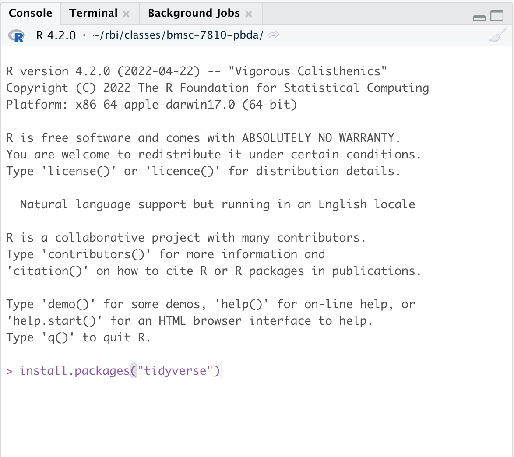
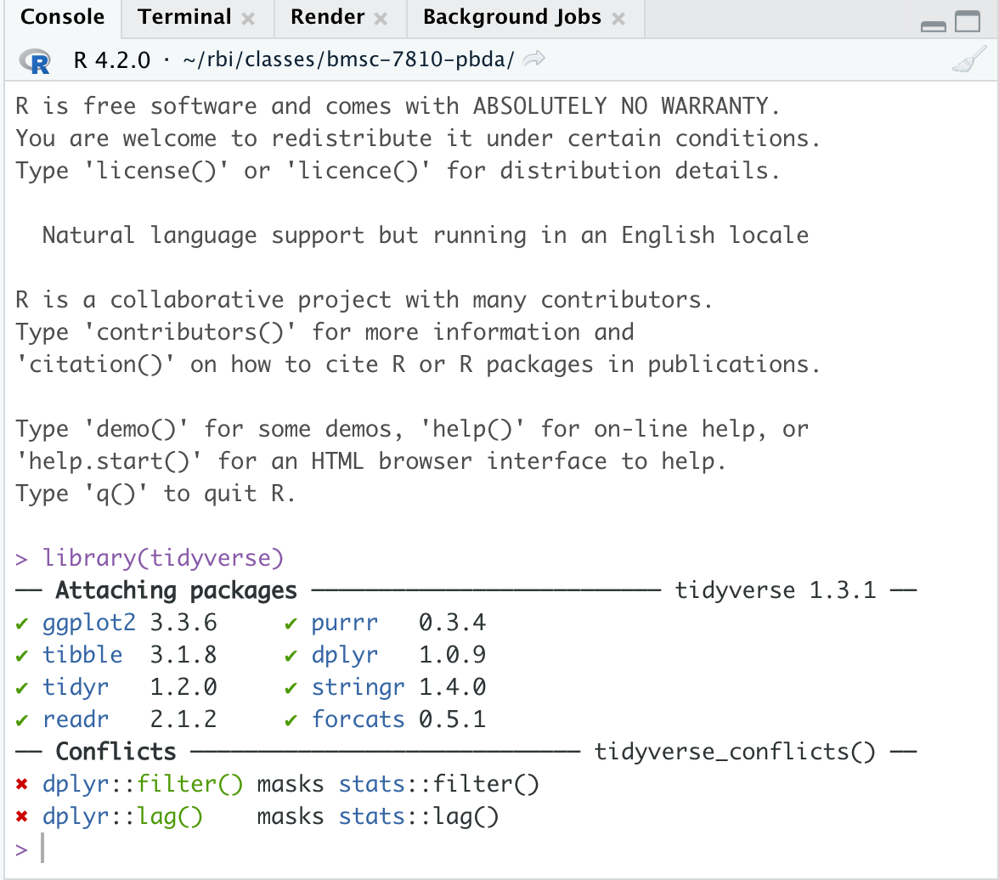

This article will explain how to install R, Rstudio, and R packages. 

**Please [watch the video](#rmd_movie) that gives an overview of using Rstudio, installing packages, and the Rmarkdown format.**

## Installing R

Download R from CRAN. Go to the CRAN homepage https://cran.r-project.org/. Select the link to download R for your operating system. 

*If you already have R installed, we recommend upgrading to the latest version of R by following the directions below* 

### Windows

Go to [CRAN](https://cran.r-project.org/), and click `Download R for Windows`. Next click the `base` link and select `Download R-4.3.2 for Windows` to download the `.exe` file. Open this file to install R. 

### MacOS

Go to [CRAN](https://cran.r-project.org/), and click `Download R for macOS`. Under `Latest Release` there are two options available depending on which CPU is used in your laptop. Mac uses either Intel (x86) or arm64 (i.e. M1 or M2) processors. You can determine which type you have by clicking on the Apple menu and selecting "About this Mac". Next to `Chip` or `Processor`, it will say either M1 or M2, if you have an arm64 CPU, or it will say Intel Core or similar, indicating you have an Intel x86 CPU.

Download the `R-4.3.2-arm64.pkg` for arm64 or `R-4.3.2-x86_64.pkg` for Intel x86. Open and follow the prompts to install. 


### Linux

If you are on linux, then follow the documentation for your linux OS. 
  
## Install Rstudio

Go to the [Rstudio website](https://posit.co/download/rstudio-desktop/#download) and download Rstudio Desktop for your operating system 

Once downloaded and installed, open up `Rstudio` to complete the rest of the tutorial.  


## Install compiler tools  

Some R package installations may require a compiler, which is usually not available by default on Windows or macOS. 

### Windows

You need to install `Rtools` from CRAN. Follow this link to download RTools 4.3 using the `Rtools43 installer` https://cran.r-project.org/bin/windows/Rtools/ .

### MacOS

To install the necessary compilers, we will follow the recommend steps outlined by CRAN: https://mac.r-project.org/tools/  

#### Xcode
First you will need to install the `Xcode` command line tools. To do so open Rstudio and click on the "Terminal" tab, which is to the right of the "Console" Tab. Alternatively you can open the Terminal app directly from `/Applications/Utilities/` or use the spotlight search tool, search for "terminal", and open the Terminal App.
     
Type the following into the terminal and hit `Enter`: 

```bash
sudo xcode-select --install
```

When prompted for `Password:`, type in your macOS user password (you wont see any characters printed as you type), and press enter. Click “Install” in the pop up and agree to the license agreement (if you agree of course). This download will require ~9Gb of space so it will take some time to download and install. Verify the installation by typing into terminal:

```bash
gcc --version
```

Which should print something similar to either this:  

```bash
#' gcc (GCC) 4.8.5
#' Copyright (C) 2015 Free Software Foundation, Inc.
#' This is free software; see the source for copying conditions.  There is NO
#' warranty; not even for MERCHANTABILITY or FITNESS FOR A PARTICULAR PURPOSE.

```

or this:
 
```bash
#' Configured with: --prefix=/Library/Developer/CommandLineTools/usr --with-gxx-include-dir=/Library/Developer/CommandLineTools/SDKs/MacOSX.sdk/usr/include/c++/4.2.1
#' Apple clang version 13.0.0 (clang-1300.0.29.30)
#' Target: arm64-apple-darwin21.3.0
#' Thread model: posix
#' InstalledDir: /Library/Developer/CommandLineTools/usr/bin
```

Here's a [youtube video explainer](https://www.youtube.com/watch?v=Z01lzHNrSdU&feature=emb_title) that also shows the process.
  
#### gfortran

Next you need to install `gfortran`. If you've installed the most recent version of R (or at least 4.3.0), then you can install using the [gfortran-12.2-universal.pkg](https://mac.r-project.org/tools/gfortran-12.2-universal.pkg). 

Once you've run the `gfortran` installer the last step is to make sure that this program is in your [`PATH`](https://en.wikipedia.org/wiki/PATH_(variable)). This step will make the `gfortran` program visible to R, and other programs.  

First determine which type of shell you have (typically bash or zsh). Execute the following in a terminal (click either on the terminal pane in Rstudio, or open the terminal app in macOS).

```bash
echo $SHELL
```

If you see `/bin/zsh` then make a plain text file called `.zshrc` in your home directory (e.g. `/Users/Your-macOS-username/.zshrc`), if it doesn't already exist. If instead you see `/bin/bash` then make a file called `.bashrc` in your home directory, if it doesn't already exist. You can use Rstudio to make a new plain-text file (File->New file->Text) or by opening up the Textedit app, then click Format->Make Plain Text. 

Add the following line of text to the file (and keep any other text if already present).

```bash
export PATH=$PATH:/opt/gfortran/bin
```

Save the text file to your home directory. You may need to rename the file after saving to ensure that it doesn't end with `.txt.` (e.g. rename `.zshrc.txt` -> `.zshrc`). This file will be a hidden file. Hidden files can be seen in the Finder app by pressing `Command` + `Shift` + `.` (period) to toggle on/off visualizing hidden files. 

Close and reopen Rstudio.

     
### Linux
You should have a compiler available already.
  
## Installing the tidyverse and Rmarkdown packages

Now that you have R and Rstudio set up we will install packages. 

Packages are extensions to the base R installation that provide additionally functionality to the language. In this course we will use packages from the [tidyverse](https://www.tidyverse.org/), which is a collection of packages commonly used for data science and interactive data analysis. Installing the `tidyverse` package will install an [entire collection](https://www.tidyverse.org/packages/) of tidyverse packages. 

[CRAN](https://cran.r-project.org/) is the official R package repository. CRAN has 18,000+ packages, including the tidyverse packages. Packages from CRAN are installed using the `install.packages()` R function. A successful install of a package will only need to be done once, until you update R to a new version.

Open Rstudio to launch R. Then in the console pane, execute the following command to install the [tidyverse](https://www.tidyverse.org/):

```r
install.packages("tidyverse")
```

```{r, echo = FALSE}

```


This command will take a few minutes to run while all of the packages are installed. Package installation will be completed once the `>` prompt reappears. Once complete, test package installation by loading the package(s)

```r
library(tidyverse)
```

If successful you will see something like this:

```{r, echo = FALSE}

```
An error will look like this (note misspelled package name for demonstration purposes):

```{r, echo = FALSE}
knitr::include_graphics("img/tily-load.png")
```

If loading tidyverse completes without errors then the packages have been installed. You'll also now see additional packages (`ggplot2`, `dplyr`, `tidyr`) listed under the "Packages" pane. 

If there is an error installing tidyverse, you'll likely see the following at the end of the command:

```r
#' Warning in install.packages :
#'  installation of package ‘tidyverse’ had non-zero exit status
```

If this happens, contact the course instructors to help troubleshoot the installation issue. 

Another package that we will use in the course is rmarkdown, to install run:

```r
install.packages("rmarkdown")
```

and verify installation by running `library(rmarkdown)`

## Introduction to using Rstudio and Rmarkdown {#rmd_movie}

Now that you have installed R and Rstudio, please watch this video (~20 minutes) that provides an overview of how to use Rstudio [IDE](https://en.wikipedia.org/wiki/Integrated_development_environment) and an introduction to the [Rmarkdown format](https://rmarkdown.rstudio.com/lesson-1.html).

[intro-to-rstudio.mp4](https://www.dropbox.com/s/zuh153mlp7w2fio/intro-to-rstudio.mp4?dl=0)

[intro-to-rstudio.mov](https://www.dropbox.com/s/alrmoszei1ou6vr/intro-to-rstudio.mov?dl=0)


## (Appendix) Installing packages from other sources


There are 2 additional commonly used repositories for R packages. These are not needed to complete the prerequisite but are useful resources that you will use as you perform more coding in R.

1) [Bioconductor](https://bioconductor.org/) is a repository that hosts 2,000+ bioinformatics related packages. 

To install bioconductor packages you should use the CRAN package `BiocManager`. BiocManager has a function called `install()` to install bioconductor packages. For example to install [`ComplexHeatmap`](https://jokergoo.github.io/ComplexHeatmap-reference/book/index.html)

```r
install.packages("BiocManager")
```

```r
library(BiocManager)
install("ComplexHeatmap")
# or equivalently you could run BiocManager::install("ComplexHeatmap")
```

2) [Github](https://github.com/) hosts open-source code from millions of software projects. R packages hosted on github can be installed using the `remotes` package. Packages on github are generally the development version of a package, or a package that has not been contributed to either CRAN or Bioconductor. To install you'll need to find the organization name and the repository name on github to install. 

For example to install the [LaCroixColorR package](https://github.com/johannesbjork/LaCroixColoR):

```r
install.packages("remotes")
remotes::install_github('johannesbjork/LaCroixColoR')

# or equivalently you could use BiocManager, which uses remotes internally
BiocManager::install(`johannesbjork/LaCroixColoR`)
```

